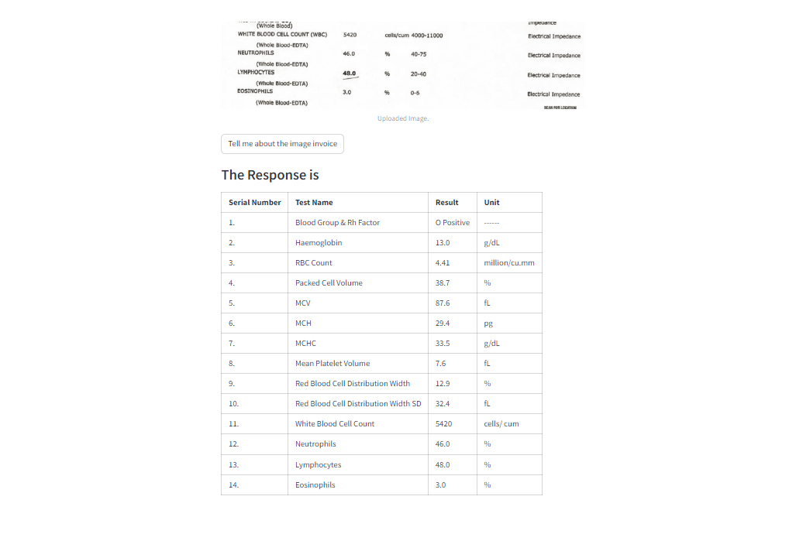

# Streamline-Health-Lab-Reports

## Streamlined Health Lab Report Data Extraction with Gemini-Pro-Vision and Streamlit
- Automate data extraction from lab reports with this interactive web platform. Powered by Google's AI and built with Streamlit.
---

Develop a user-friendly web platform that automates health lab report data extraction using Google's Gemini-Pro-Vision model, enhancing efficiency and accessibility for healthcare professionals and patients.

## Key Technologies:
- Gemini-Pro-Vision: Powerful generative language model for text and image understanding, capable of accurately extracting key information from health lab reports.
- Streamlit: Open-source Python library for rapidly building and deploying interactive web applications, enabling seamless user interaction and data visualization.

## Project Scope:
- Image Loading:
Implement functionality for users to upload health lab report images in various formats (JPEG, PNG, PDF).
- Data Extraction with Gemini-Pro-Vision:
Integrate the model to process uploaded images and extract relevant data elements in Table format, including:
- Test Names
- Reference result value
- Unit
  
## Web Platform Development with Streamlit:
Create an intuitive interface for:
- Image uploads
- Data display
- User interaction
- Display extracted data.

## Steps:
1. Upload your lab report image (JPEG, PNG, PDF).
2. Gemini-Pro-Vision extracts key results, Test Name, & Units.
3. View data in Table.

## Output:

---

---

---

